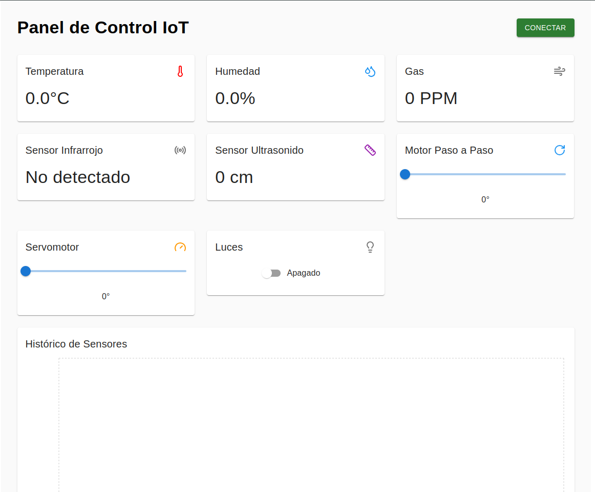

# Dashboard IoT para ESP32

Este proyecto implementa un panel de control en tiempo real para monitorear y controlar sensores y actuadores conectados a un ESP32.



## 📋 Funcionalidades

- **Monitoreo en tiempo real de sensores:**
  - Temperatura (°C)
  - Humedad (%)
  - Nivel de Gas (PPM)
  - Sensor Infrarrojo
  - Sensor Ultrasonido (cm)

- **Control de actuadores:**
  - Motor Paso a Paso (0-360°)
  - Servomotor (0-180°)
  - Control de Luces (On/Off)

- **Características adicionales:**
  - Gráficos históricos de sensores
  - Conexión WebSocket
  - Interfaz responsive

## 🚀 Guía de Instalación

### 1. Requisitos Previos
```bash
# Instalar Node.js (versión 14 o superior)
https://nodejs.org/

# Instalar git
https://git-scm.com/downloads
```

### 2. Configuración del Proyecto
```bash
# Clonar el repositorio
git clone [URL-del-repositorio]
cd dashboard-iot

# Instalar dependencias
npm install
```

### 3. Configuración del ESP32
1. Abrir el archivo `src/config.js`
2. Modificar la IP del ESP32:
```javascript
export const CONFIG = {
  ESP32_IP: '192.168.1.XXX',  // Reemplazar con la IP de tu ESP32
  ESP32_PORT: '81'
};
```

### 4. Iniciar el Proyecto
```bash
npm start
```
El dashboard estará disponible en: `http://localhost:3000`

## 🔌 Conexión con ESP32

### Formato de Datos ESP32 → Dashboard

El ESP32 debe enviar los datos en formato JSON:
```json
{
  "temperatura": 25.5,
  "humedad": 60,
  "gas": 450,
  "infrarrojo": false,
  "ultrasonido": 150
}
```

### Formato de Comandos Dashboard → ESP32
```json
{
  "tipo": "motorPaso",
  "valor": 180
}
```

### Tipos de comandos:
- `"motorPaso"`: valor entre 0 y 360
- `"servomotor"`: valor entre 0 y 180
- `"luces"`: valor boolean (true/false)

### Ejemplo de Código para ESP32

```cpp
#include <WiFi.h>
#include <WebSocketsServer.h>
#include <ArduinoJson.h>

// Configuración WiFi
const char* ssid = "TU_SSID";
const char* password = "TU_PASSWORD";

// Servidor WebSocket
WebSocketsServer webSocket = WebSocketsServer(81);

void setup() {
  Serial.begin(115200);
  
  // Conectar a WiFi
  WiFi.begin(ssid, password);
  while (WiFi.status() != WL_CONNECTED) {
    delay(500);
    Serial.print(".");
  }
  
  Serial.println("");
  Serial.println("WiFi conectado");
  Serial.println("IP: ");
  Serial.println(WiFi.localIP());
  
  // Iniciar WebSocket
  webSocket.begin();
  webSocket.onEvent(webSocketEvent);
}

void loop() {
  webSocket.loop();
  
  // Leer sensores cada 2 segundos
  static unsigned long lastTime = 0;
  if (millis() - lastTime > 2000) {
    enviarDatosSensores();
    lastTime = millis();
  }
}

void enviarDatosSensores() {
  StaticJsonDocument<200> doc;
  
  // Leer sensores
  doc["temperatura"] = leerTemperatura();
  doc["humedad"] = leerHumedad();
  doc["gas"] = leerGas();
  doc["infrarrojo"] = leerInfrarrojo();
  doc["ultrasonido"] = leerUltrasonido();
  
  String output;
  serializeJson(doc, output);
  webSocket.broadcastTXT(output);
}

void webSocketEvent(uint8_t num, WStype_t type, uint8_t * payload, size_t length) {
  switch(type) {
    case WStype_DISCONNECTED:
      Serial.printf("[%u] Desconectado!\n", num);
      break;
    case WStype_CONNECTED:
      Serial.printf("[%u] Conectado!\n", num);
      break;
    case WStype_TEXT:
      // Procesar comandos recibidos
      String comando = String((char*)payload);
      procesarComando(comando);
      break;
  }
}

void procesarComando(String comando) {
  StaticJsonDocument<200> doc;
  DeserializationError error = deserializeJson(doc, comando);
  
  if (error) {
    Serial.println("Error al parsear JSON");
    return;
  }
  
  const char* tipo = doc["tipo"];
  int valor = doc["valor"];
  
  // Ejecutar comandos
  if (strcmp(tipo, "motorPaso") == 0) {
    controlarMotorPaso(valor);
  } else if (strcmp(tipo, "servomotor") == 0) {
    controlarServomotor(valor);
  } else if (strcmp(tipo, "luces") == 0) {
    controlarLuces(doc["valor"].as<bool>());
  }
}
```

## 📝 Notas Importantes

1. **Conexión WiFi:**
   - El ESP32 y el dispositivo que ejecuta el dashboard deben estar en la misma red
   - Usar una red WiFi estable
   - Configurar una IP estática en el ESP32 es recomendado

2. **Seguridad:**
   - Este es un proyecto de demostración
   - Para producción, agregar autenticación y SSL
   - No exponer el WebSocket a Internet sin seguridad

3. **Solución de Problemas:**
   - Verificar que la IP del ESP32 sea correcta
   - Comprobar que el puerto 81 esté disponible
   - Revisar la consola del navegador para errores
   - Verificar el monitor serial del ESP32

## 🛠️ Personalización

### Modificar Intervalos de Actualización
En `src/config.js`:
```javascript
export const CONFIG = {
  UPDATE_INTERVAL: 2000,  // Intervalo en milisegundos
  MAX_HISTORICAL: 20      // Número de puntos en el gráfico
};
```

### Agregar Nuevos Sensores
1. Agregar el sensor al estado inicial en `DashboardIoT.js`
2. Crear un nuevo componente Card para el sensor
3. Actualizar el formato JSON en el ESP32

## 📱 Responsive Design

El dashboard es completamente responsive:
- Desktop: 3 columnas
- Tablet: 2 columnas
- Mobile: 1 columna

## 🤝 Soporte

Para soporte y consultas:
- Crear un Issue en el repositorio
- Contactar al desarrollador: fconiglio100@gmail.com

## 📄 Licencia

Este proyecto está bajo la Licencia MIT